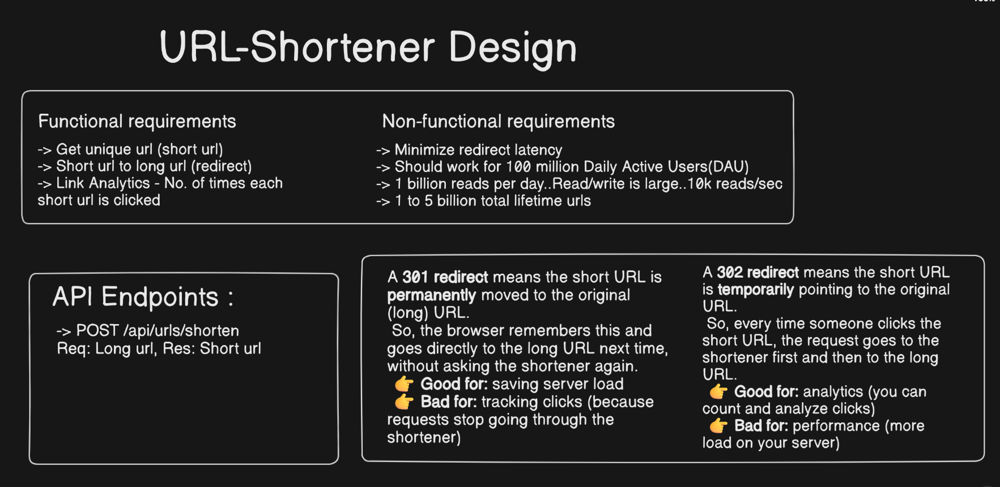
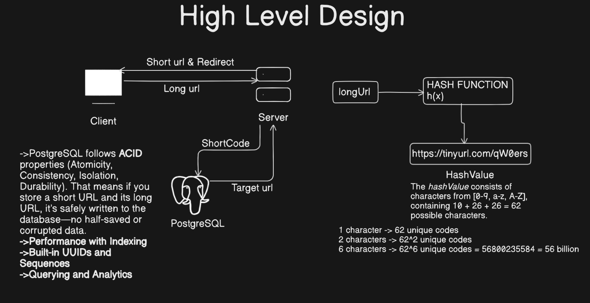
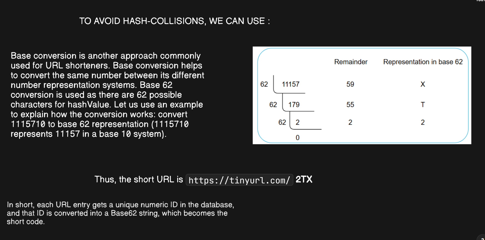
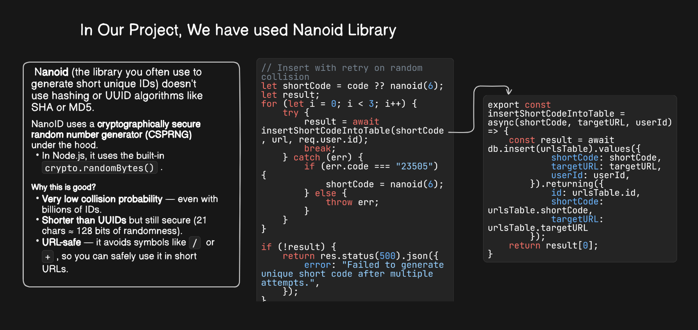
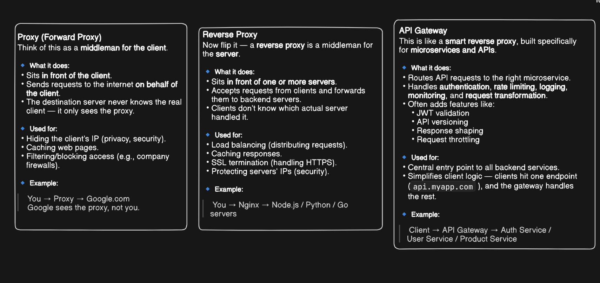
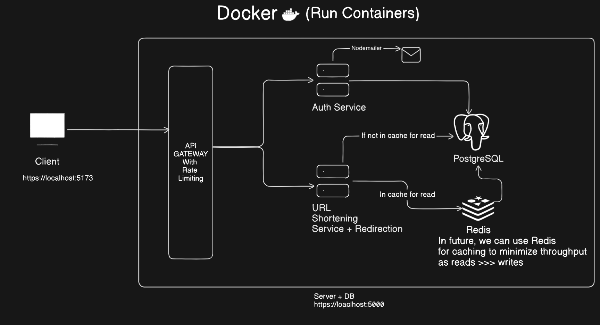
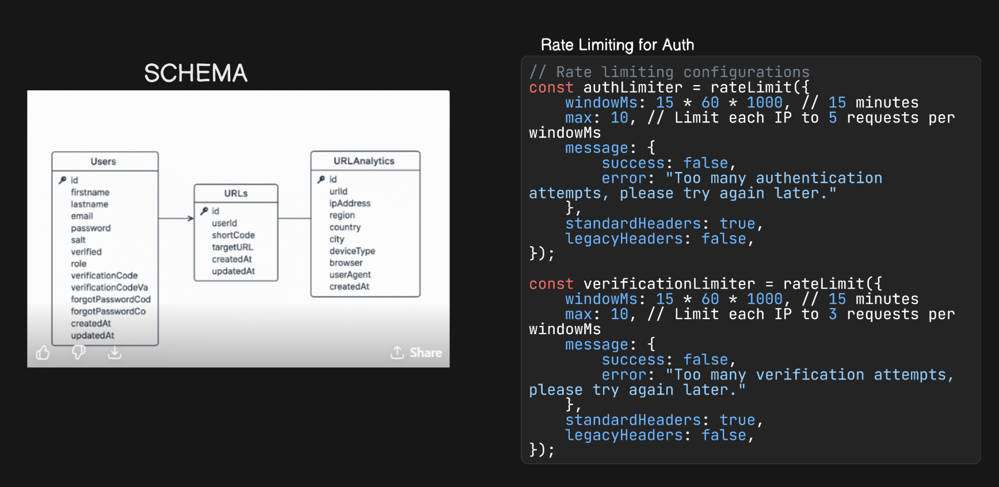
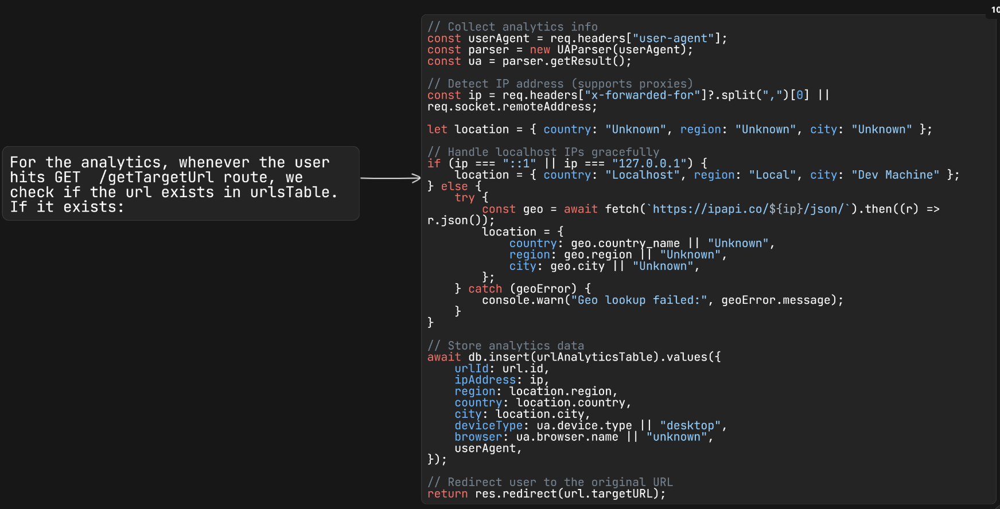
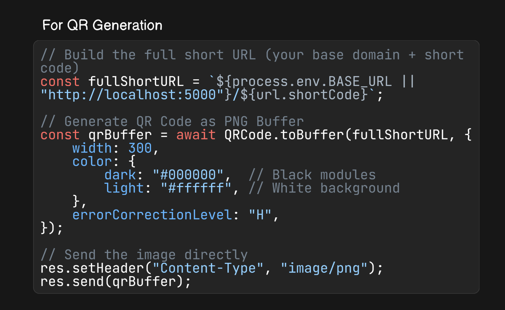

## URL Shortener

A full-featured URL Shortener with authentication, analytics, and QR code generation built for modern web use.  

---

## Demo

🎬 Watch the demo video here:  
[URL Shortener Demo](https://drive.google.com/file/d/1HTfaw1APfA2tJFDsgzNwfRdnXnLqFp7V/view?usp=sharing)

---

## Tech Stack

- **Frontend:** React + TypeScript + Tailwind + Shadcn  
- **Backend:** Node.js + Express  
- **Database:** PostgreSQL via Drizzle ORM  
- **Other:** Docker, Nodemailer, Nanoid, JWT 

---

## Features

- User signup and login with rate-limited authentication  
- Send & verify email codes for signup and password recovery  
- Change password and update first/last name  
- Create, update, and delete shortened URLs  
- View all created URLs and analytics for each  
- Generate QR codes for shortened URLs  
- Redirect short URLs to their target destinations  

---

## System Design

  
  
  
  
  
  
  
  
  


# Flow Chart 
User

   │
   ▼

Enter Long URL

   │
   ▼

Click "Shorten"

   │
   ▼

Backend validates URL

   │
   ▼

Generate unique short code

   │
   ▼

Store in MongoDB

   │
   ▼

Return shortened URL

   │
   ▼

User shares URL

   │
   ▼

Someone opens URL

   │
   ▼
   
Redirect to original URL

---

# 8. Database Design

## Collection: links

| Field | Type | Description |
|--------|------|-------------|
| _id | ObjectId | Primary key |
| originalUrl | String | Original URL |
| shortCode | String | Unique short code |
| clicks | Number | Total clicks |
| createdAt | Date | Creation timestamp |
| updatedAt | Date | Last update |

Example

```json
{
  "_id": "...",
  "originalUrl": "https://google.com",
  "shortCode": "Ab12Cd",
  "clicks": 5,
  "createdAt": "2026-07-09T10:00:00Z"
}


